<h1> Introduction </h1>
We chose to work on this dataset since it was simple to grasp and few of our members were very interested in FIFA and football (**not soccer**).This dataset proved useful for learning exploratory data analysis. We first organized a team and began looking for a suitable dataset. We then created a shared repository for us to work on at any time with seamless integration and were taught how to use GitHub. We learned project management skills and worked on preparing our dataset. We processed and cleaned our dataset, performed exploratory data analysis (EDA), built some data visualizations, and experimented with Pandas method chaining. Finally, we exhibited our efforts in a Tableau Dashboard. We were also given feedback and given opportunity to tweak our project.

This data set was found on kaggle.com from the author, BRYANB. The author was able to procure the date from another website called Sofifa which houses data about players and teams from various FIFA games and this dataset includes 16000+ unique player stats from FIFA 22. This data consists of aggregated data such as name of the players, age, country and detailed data such as offensive potential, defense, acceleration. The dataset we use is specifically for the FIFA 22 game and was updated last on October 2022. This data was collected using beautifulsoup from the website Sofifa. General information from was scraped from the main page and each player's webpage was scraped individually. This was done by defining a batch size to parallelize the retrieving of data and then the dataframes were merged and cleaned.

 

<h1>Exploratory Data Analysis </h1>

During our EDA, we found that there are 16000+ unique players in our dataset but only about 6000 were currently playing. We found out the that the data set had the name, age, physical attributes, financial attributes and international attributes. There were a total of 65 columns.

 

<h1>Research Questions </h1>

<h2>Question 1:</h2>

<h3>What is the relationship between a players financial figures and their other attributes?</h3>

First, we look at a heat map of some playing characteristics and their relationship to the financial data. 

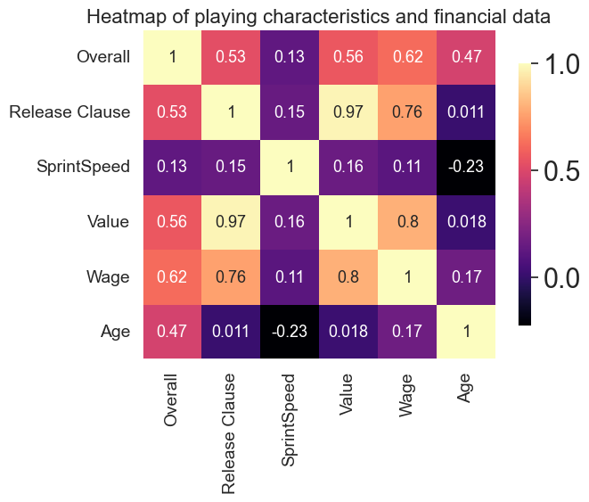  

We can see that the age of a player barely has any correlation with the players value and release clause. But Age plays a significant role in the overall of a player.
We can also see that the overall rating of a player has a greater effect on their wage than value. And since age has a correlation with overall, we can say that even though it is not apparent in the heatmap, there is some correlation between the age and value.
We also see strong connections of the release clause with value and wage. 

 

Next,  we see if physical attributes have an effect on value. For this we will use a heat map again as it gives us the most detail. 

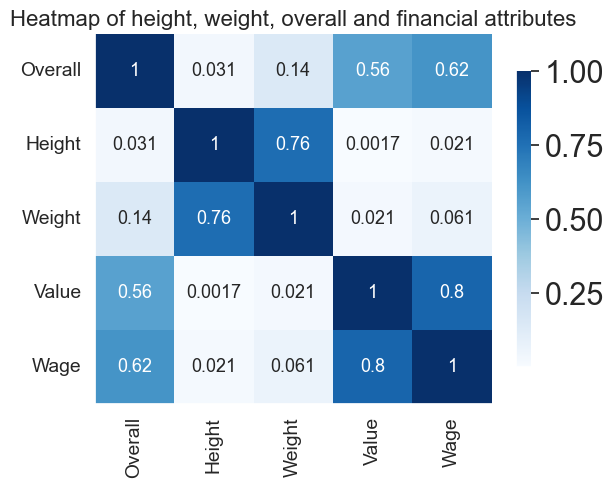 

We see that physical attributes such as height and weight have no correlation with a players value and the values in the heat map are very close to 0 indicating that there is no correlation. As expected, height and weight have a strong correlation as well as value and wage. There is also some correlation between a players overall with value and wage. 

 

 

We will now plot avg. wage and avg. value vs the nationality of the players  

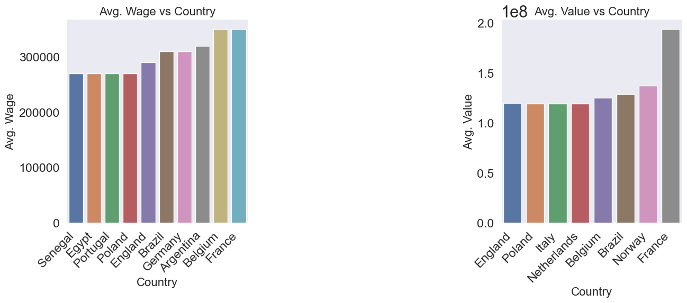 

We can make some findings from these graphs. Although England has by far the most number of players in the game, the most valuable countries are Spain and Brazil. We also noticed a correlation to the players overall and value and we can make an assumption that the overall quality of players from Spain and Brazil are higher than that of England. This can also be seen in case of the wage as the total wages are almost the same. 
We also see that the top 8 countries in both categories are from Europe and South America.

 

 Let us now see which positions are most valuable and the most highest paid. 

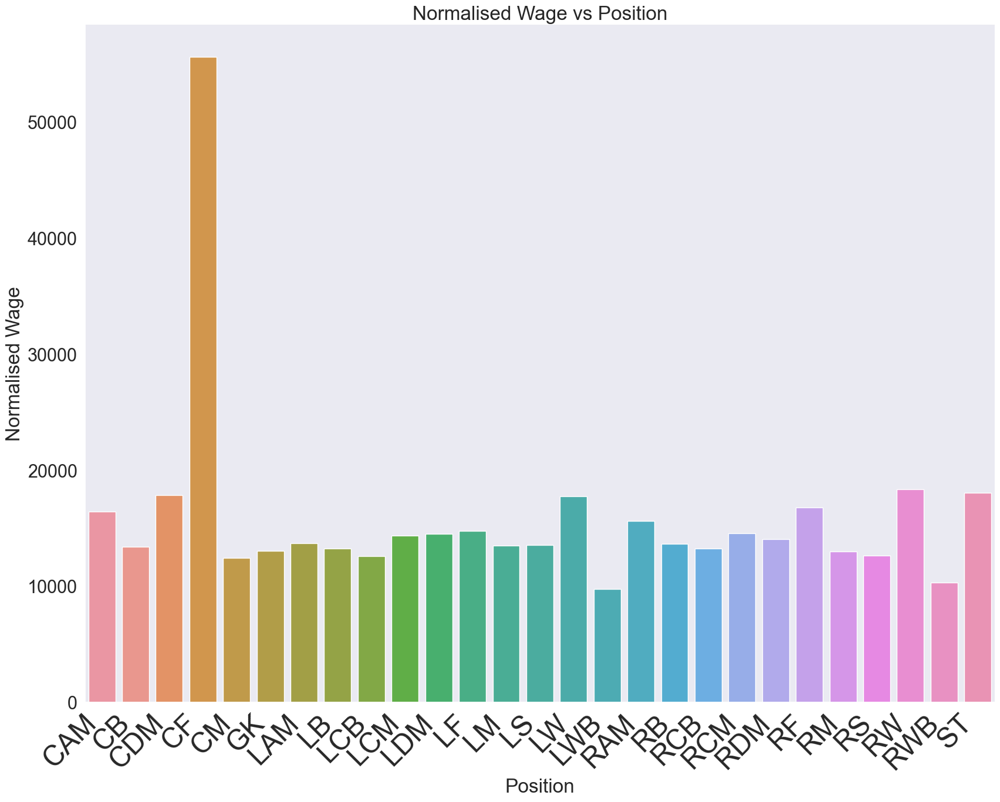    
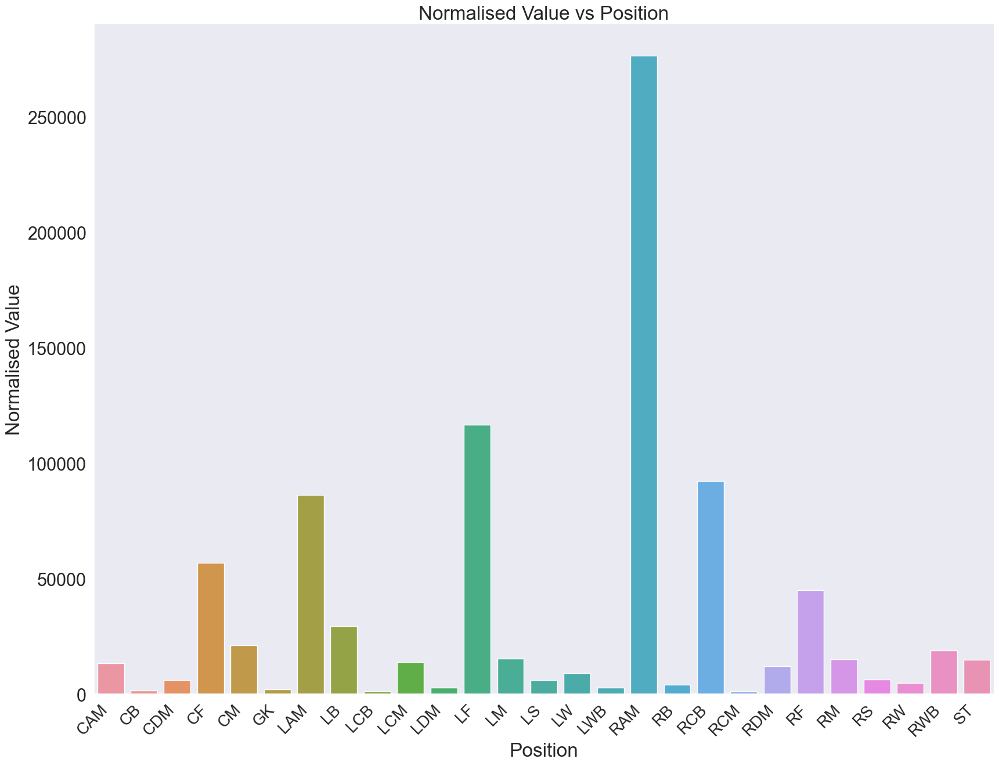 

 We notice that CF was the highest paid compared to any other position. All other positions are paid very similarly and that is around 1/3 the average wage of CF. ALthough RAM and CF have the same number of players, RAM is not even the second most paid position. This might be due to CF positions having more star players. 
RAM position players are most valuable players followed by LF, LAM, RCB and CF. This is surprising considering that CF players were payed much higher than any position. This maybe due to the fact that most CF players are star players and bring in a lot of sponsors for the teams compared to other positions. 

 

The following is what can answer the above question:
1. Age has no direct correlation to value. But, overall has some correlation to the age and value. From this, we can see that there might be some indirect correlation between age and value.
1. Wage and Release Clause have a linear relationship with Value
1. On average, players from Europe and South America are valued more and have higher wages
1. CF and RAM are the most rarest players. CF players are the most paid and RAM players are the most valued. They both are not in the top 3 of the other category.
 
[You can find the full analysis notebook here, including the code and the data here](./notebooks/analysis1.ipynb)

 
<h2> Question 2: </h2>

<h3> I wish to find out if Center Attack Midfielders are generally better than players in other positions, as CAM are often thought of as the most technically gifted. </h3>

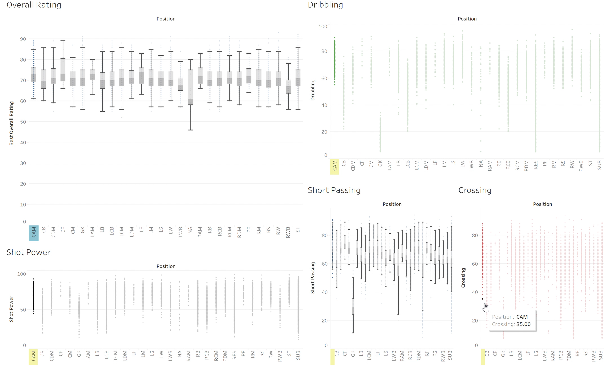  

 
I used the five stats that have been graphed above. I used them because my knowledge of FIFA is quite limited and I thought of these stats to be the most "skillful" of what was in the data set. 
  
I used the overall rating to see where the CAM position compared to the others in general. This gave me a good starting point, so far the CAM position is really good, but is not far and above other positions.However, this led me to question wether or not certain positions on the field are more prone to more/less of a certain stats, purely based on physical position on the field. So as the CAM position is further up the field their defensive stats ended up being much lower than many other positions. I concluded that the CAM position must be in a worse place to gain defensive stats. So I removed the defensive stats from the analysis as I wanted to know if CAM players were the most technically gifted. I was left with dribbling, short passing, crossing, and shot power. I found that the CAM players are still arguably contains the best offensive technical players on the field, however the position itself is not far more or less impressive than many other position.
 
[You can find the full analysis notebook here, including the code and the data here](./notebooks/analysis2.ipynb)

 

<h2>Question 3:</h2>

<h3>Part 1: Relationship Between Age and Performance</h3>

To find out a relationship between age and performance, we use a simple scatter plot with age on y-axis and player performance or overall rating on the x-axis.
We can clearly see a linear positive relationship as age increases, overall increases but we do see an overplot in certain regions indicating that most of the players are in that overall and age region.

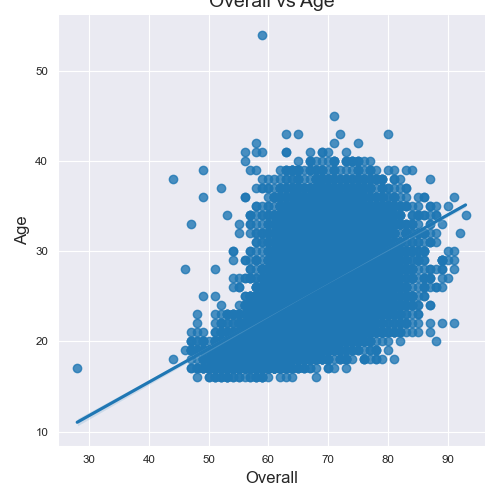   
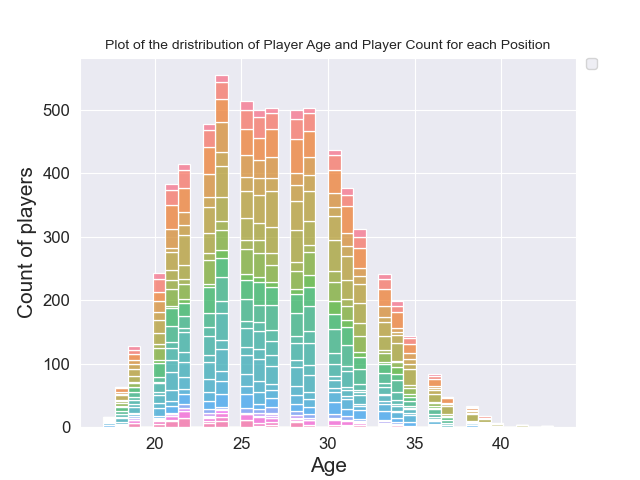   

 
<h3>Part 2: Using specific stats with Age and Performance</h3>

We took a few different plots to see the specific differences between stats and overall and age
 

a) Heatmap of Overall, Shooting Attributes and Age: a positive correlation with age and shot power (indicating an increase in shot power with age) and shooting attributes with overall 

  
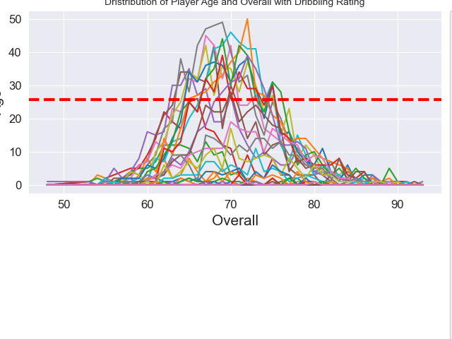   

 

b) Distribution of Player Age and Overall with Dribbling Rating: shows that the dribbling rating usually peaks around age 24-27 and tends to drop after that age.

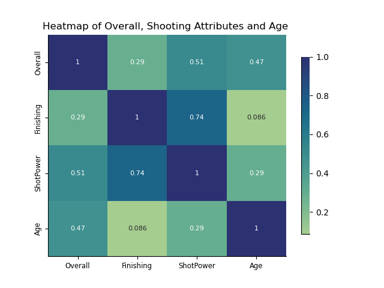 

c) Specific Age and Overall vs ATT, DEF, PAC, PHY, DRI, and PAS plots are shown on Dashboard3, interesting trends such as a positive correlation relationship between technical attributes (ATT, DEF, DRI, PAS) while there is a negative correlation with PHY and PAC attributes with an exception in Strength as age increases.
 

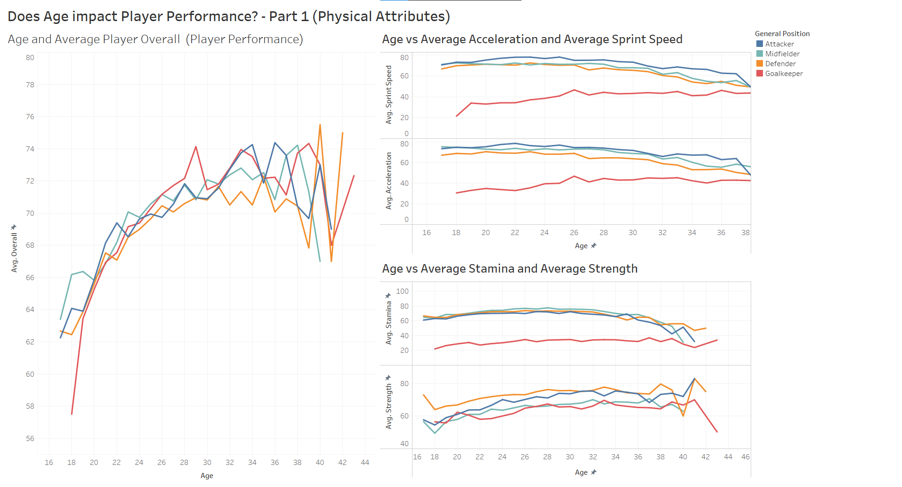 
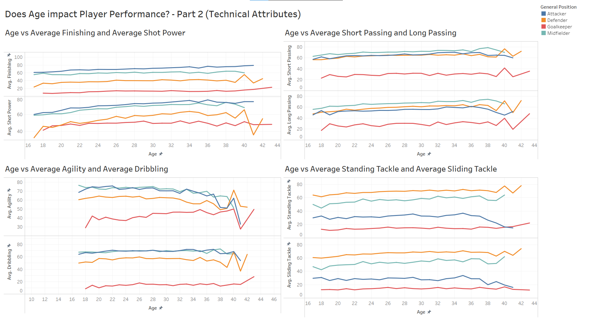 

 

<h1>Conclusion</h1>

From our exploratory data analysis project looking at a FIFA 2022 data set, we have answered the questions: What is the relationship between a players financial figures and their other attributes? Are Center Attack Midfielders (CAM) are generally better than players in other positions? What is the relationship between age of the player with position and performance, and with other attributes? We found: age, nationality, position, and overall all correlated in some way to the value of a player, CAMs are very good, but not exceedingly better than players in other positions in general, and overall rating and technical attributes increase with age, however stats surrounding strength decrease as age increases.

 
