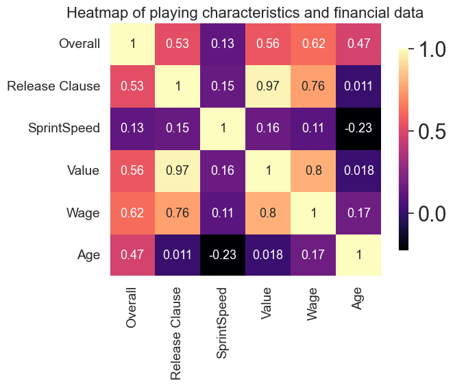
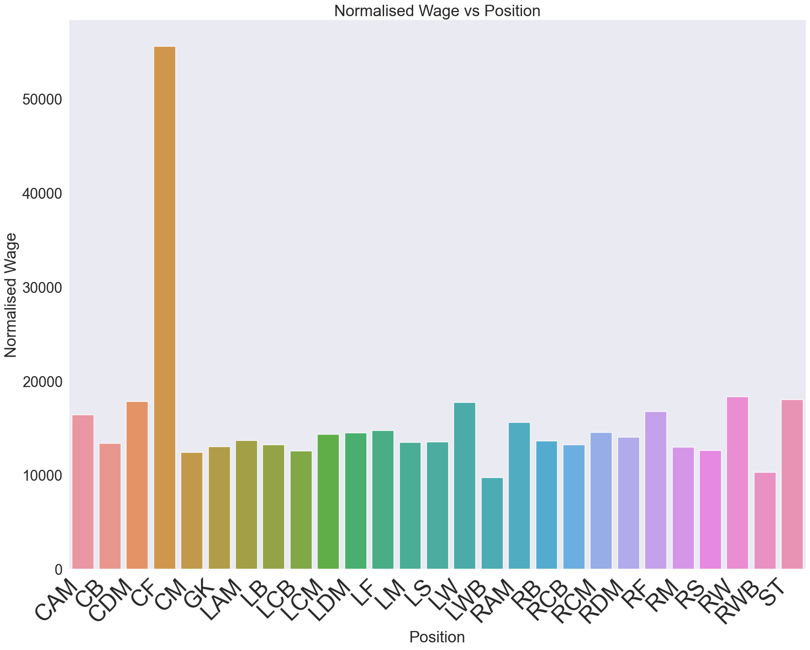

<h1>Exploratory Data Analysis </h1>

During our EDA, we found that there are 16000+ unique players in our dataset but only about 6000 were currently playing. We found out the that the data set had the name, age, physical attributes, financial attributes and international attributes. There were a total of 65 columns.
 

<h1>Research Questions </h1>

<h2>Question 1:</h2>

<h3>What is the relationship between a players financial figures and their other attributes?</h3>

First, we look at a heat map of some playing characteristics and their relationship to the financial data. 

  

We can see that the age of a player barely has any correlation with the players value and release clause. But Age plays a significant role in the overall of a player.
We can also see that the overall rating of a player has a greater effect on their wage than value. And since age has a correlation with overall, we can say that even though it is not apparent in the heatmap, there is some correlation between the age and value.
We also see strong connections of the release clause with value and wage. 

 

 

Next,  we see if physical attributes have an effect on value. For this we will use a heat map again as it gives us the most detail. 

 

We see that physical attributes such as height and weight have no correlation with a players value and the values in the heat map are very close to 0 indicating that there is no correlation. As expected, height and weight have a strong correlation as well as value and wage. There is also some correlation between a players overall with value and wage. 

 

 

We will now plot avg. wage and avg. value vs the nationality of the players  

 

We can make some findings from these graphs. Although England has by far the most number of players in the game, the most valuable countries are Spain and Brazil. We also noticed a correlation to the players overall and value and we can make an assumption that the overall quality of players from Spain and Brazil are higher than that of England. This can also be seen in case of the wage as the total wages are almost the same. 
We also see that the top 8 countries in both categories are from Europe and South America.

 

 

 Let us now see which positions are most valuable and the most highest paid. 

    
 

 We notice that CF was the highest paid compared to any other position. All other positions are paid very similarly and that is around 1/3 the average wage of CF. ALthough RAM and CF have the same number of players, RAM is not even the second most paid position. This might be due to CF positions having more star players. 
RAM position players are most valuable players followed by LF, LAM, RCB and CF. This is surprising considering that CF players were payed much higher than any position. This maybe due to the fact that most CF players are star players and bring in a lot of sponsors for the teams compared to other positions. 

 

 

The following is what can answer the above question:
1. Age has no direct correlation to value. But, overall has some correlation to the age and value. From this, we can see that there might be some indirect correlation between age and value.
1. Wage and Release Clause have a linear relationship with Value
1. On average, players from Europe and South America are valued more and have higher wages
1. CF and RAM are the most rarest players. CF players are the most paid and RAM players are the most valued. They both are not in the top 3 of the other category.

 

 